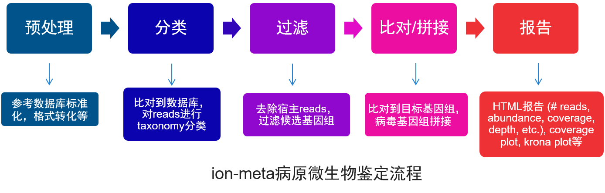
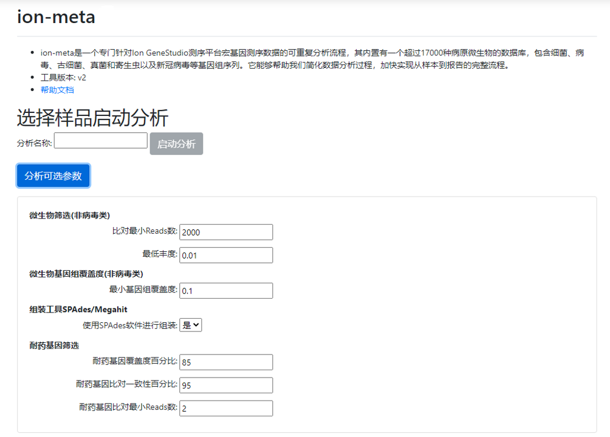
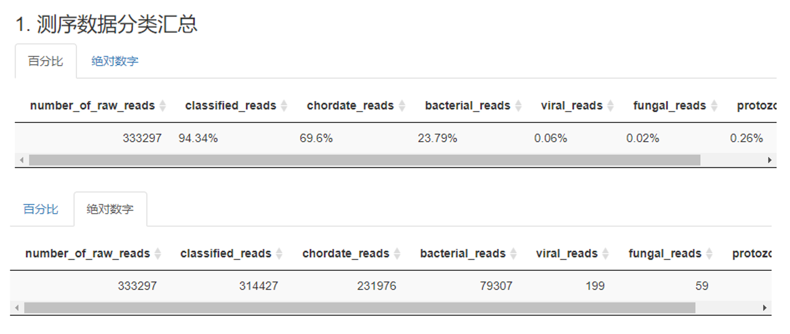
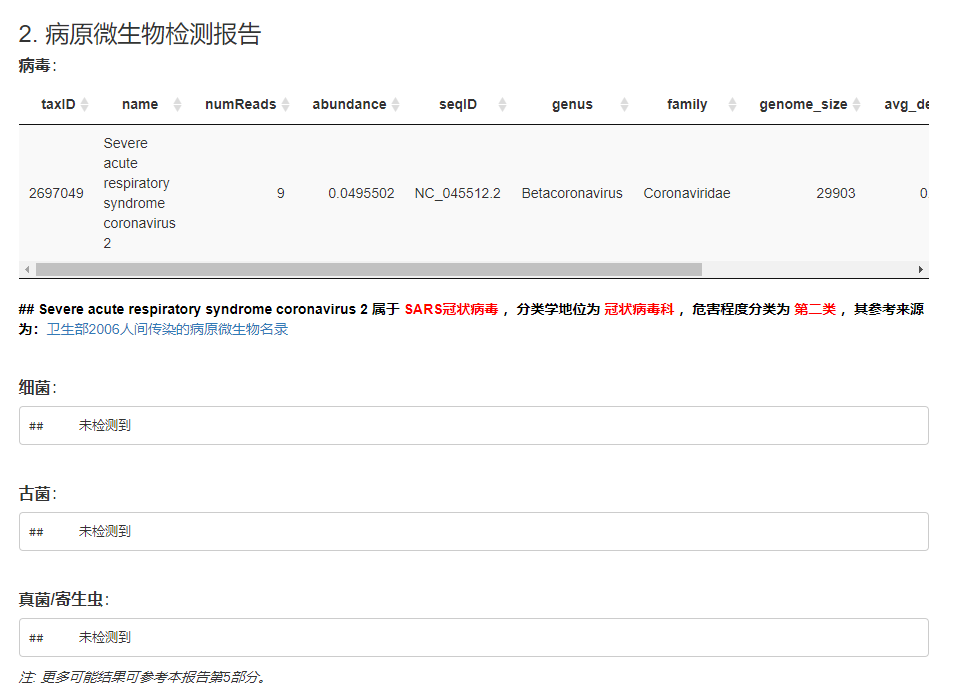
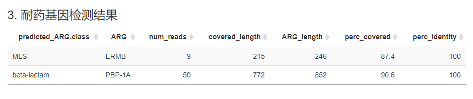
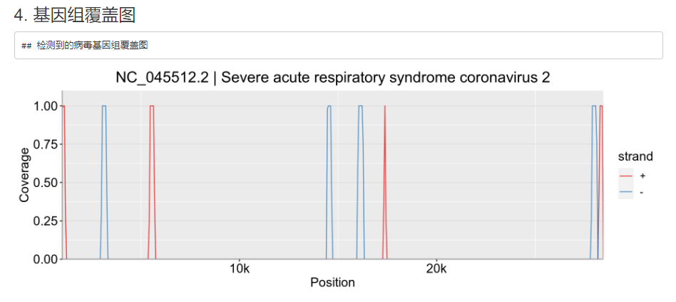
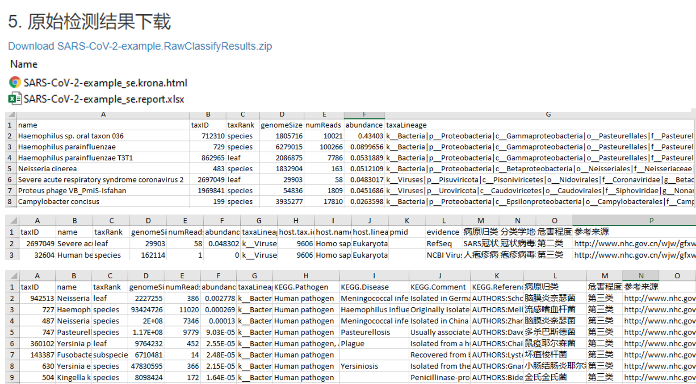
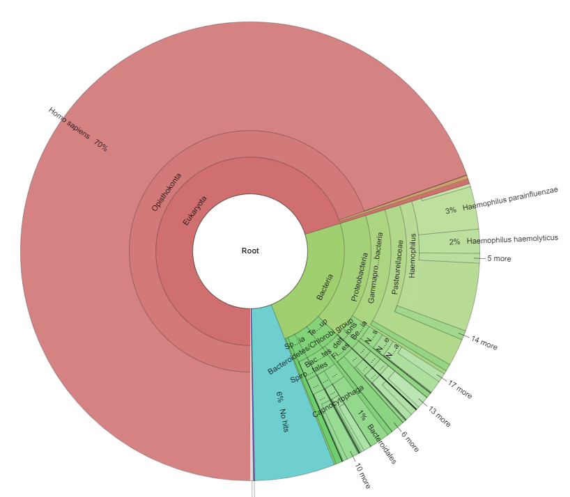
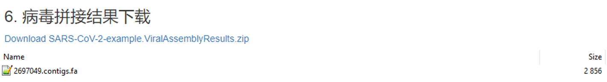

     
 ion-meta分析工具简介
================

版本信息
--------

-   工具版本：v2
-   文档版本：v2
-   更新日期：2020-11-24

工具简介
--------

ion-meta是一个专门针对Ion GeneStudio测序平台宏基因测序数据的可重复分析流程，其预装有一个超过17000种病原微生物的数据库，包含细菌、病毒、古细菌、真菌和寄生虫以及新冠病毒等基因组序列。该流程的核心包括在以BWT（Burrows-Wheeler Transform）和FM（Ferragina-Manzini）index方法构建参考数据库索引后，采用K-mer精确匹配算法，将原始reads分类到相应的微生物基因组上，并进一步对分类结果进行分析过滤、复比对和关键参数计算，最终自动化生成病原微生物检测报告，报告页面包含疑似致病微生物的比对序列数、相对丰度、基因组覆盖度和测序深度等信息。此外，ion-meta标准化了国家卫生部2006年《人间传染的病原微生物名录》，可对具人间传染性的病原微生物进行醒目标识，并能够提供病毒宿主、细菌真菌病原菌等其他注释信息。ion-meta还包含一个耐药基因鉴定与注释模块，能够直接从宏基因组测序数据中识别出潜在的耐药基因。

运行 ion-meta分析工具
---------------------

1.  点击下图左侧红框中的分析工具；

2.  点击下图右侧红框中的 ion-meta；

3.  在列出的样本表格中勾选想要分析的样本，每次最多选择10个样本；

4.  在列出的样本表格中勾选想要分析的样本；输入分析名称，点击启动分析； 

注：分析名称可以使用中文，但不能包含空格或特殊字符。

ion-meta 分析结果
-----------------

ion-meta宏基因组数据分析结果以报告的形式呈现，其可以分成六个部分：1. 宏基因组分析结果汇总，显示了总测序reads中分类到不同物种的百分比或绝对数字；2. 病毒、细菌、古菌、真菌/寄生虫等病原菌检测结果，包括比对上的reads数目、丰度。对于检测到的病原菌，其基因组是基于reads比对上的覆盖度挑选的，以覆盖度最高的作为其最相配基因组，并依据序列比对结果，计算相应的病原菌基因组测序深度与覆盖度等参数；3. 耐药基因分析结果；4. 病原菌基因组的测序覆盖图；5. 数据分析原始结果下载，其中包含许多潜在的其他病原菌检测结果，并注释已知的病毒宿主、细菌真菌等病原菌信息作为进一步参考；6. 对于病毒类目标物种，如果比对上的reads能够拼接，则提供拼接基因组草图结果下载。

### 测序数据分类汇总

统计了样本测序的原始序列数，以及分别比对到宿主、细菌、病毒、真菌和原生动物参考基因组的序列数和百分比。汇总表格分为两个标签：1. 百分比：比对到不同类群序列数占总序列数的百分比值；2. 绝对数字：比对到不同类群的序列数。

表格注释：

-   number\_of\_raw\_reads：该样本原始序列总数
-   classified\_reads：能比对上数据库参考基因组的序列总数
-   chordate\_reads：比对上数据库中脊索动物参考基因组的序列数，通常指人源宿主序列
-   bacterial\_reads：比对上细菌参考基因组的序列数
-   viral\_reads：比对上病毒参考基因组的序列数
-   fungal\_reads：比对上真菌参考基因组的序列数
-   protozoan\_reads：比对上原生动物参考基因组的序列数

### 病原微生物检测报告

通过表格展示了本次样本中检测到的微生物，根据物种分类信息分为病毒、细菌、古生菌和真菌或原核生物四个检测结果。每个表格给出了检出微生物的物种名和科属信息，分类信息来源于NCBI Taxonomy数据库，可以通过taxID或基因组序列ID号检索到。表格还统计了微生物的比对序列数、丰度、基因组大小、测得序列对微生物基因组的覆盖度和平均测序深度，并且会根据检出微生物的序列丰度从高到低排序。如果在检测到的病原微生物中，发现包含有属于国家卫生部2006年《人间传染的病原微生物名录》中的，则进一步对这些具人间传染性的病原微生物进行醒目标识。若该分类下不能从原始序列中比对分析得到疑似病原微生物，则提示未检出。

表格注释：

-   taxID：检出微生物在NCBI-Taxanomy中的唯一编号
-   name：检出微生物的物种拉丁名
-   numReads：检出微生物的严格唯一比对序列数
-   abundance：检出微生物的相对丰度
-   seqID：检出微生物基因组序列在NCBI中的唯一编号
-   genus：检出微生物的属名
-   family：检出微生物的科名
-   genome\_size：检出微生物的基因组染色体大小
-   avg\_coverage：检出微生物基因组染色体的平均测序深度
-   covered\_bp：比对上的序列覆盖到该检出微生物基因组染色体的长度
-   perc\_covered：检出微生物的基因组染色体覆盖度百分比

### 耐药基因检测结果

基于深度学习算法模型，直接从样本宏基因组测序数据中，预测其包含的潜在耐药基因，并列出满足筛选条件的耐药基因相关的信息，筛选条件可在ion-meta运行的页面进行设置，包括比对上的reads数目、覆盖的耐药基因长度的百分比、与耐药基因之间的序列一致性百分比等。

表格注释：

-   predicted_ARG.class：预测的耐药基因针对的抗生素类型
-   ARG：即antibiotic resistance gene，抗生素耐药基因
-   num_reads：比对上耐药基因的reads数目
-   covered_length：耐药基因被比对覆盖上的长度
-   ARG_length：耐药基因长度
-   perc_covered：耐药基因被比对覆盖上的百分比
-   perc_identity：耐药基因被比对上的平均序列一致性百分比

### 基因组覆盖图

通过折线图表示了测序数据在检出微生物全基因组上的分布情况。图中标题是微生物基因组序列ID和物种拉丁名，横坐标表示微生物基因组位置，纵坐标表示该位置比对上的序列数（图表显示的Coverage上限为2500，即如果Coverage超过2500，则显示为2500）。红色和蓝色线分别表示测得序列是DNA正链和负链。

### 原始检测结果下载

点击Download链接可以下载该样本原始的分析结果压缩文件，文件中包含了一个表格文件（可用excel打开）和一个网页文件。表格文件中含有三张表格，raw_classify_results汇总了样本序列比对上的所有潜在微生物分类信息和序列数目，其中各列的涵义如下：

-   第一列是比对上的微生物物种名；
-   第二列是该物种在NCBI中的物种分类ID号；
-   第三列是该物种分类地位信息；
-   第四列是该物种的基因组大小；
-   第五列是只比对到该物种的唯一序列数；
-   第六列是该物种在检测样本中的序列丰度；
-   第七列是该物种的物种分类谱系信息。

注：标题栏后第一行物种名如果是root，表示样本中的有一些测序数据不能比对到数据库中的任何物种基因组序列；第三列的物种分类地位如果是leaf，表示该物种的分类单元为最下层。

virus_classify列出了检出的病毒，并进一步在raw_classify_results表格列的基础上，对这些病毒进行更多注释，包括：

-   host.tax.id：病毒宿主tax ID；
-   host.name：病毒宿主名称；
-   host.lineage：病毒宿主物种分类谱系；
-   pmid：支持文献的PubMed ID；
-   evidence：证据来源；
-   病原归类：来自于国家卫生部2006年《人间传染的病原微生物名录》的相应列；
-   分类学地位：来自于国家卫生部2006年《人间传染的病原微生物名录》的相应列；
-   危害程度分类：来自于国家卫生部2006年《人间传染的病原微生物名录》的相应列；
-   参考来源：国家卫生部2006年《人间传染的病原微生物名录》，http://www.nhc.gov.cn/wjw/gfxwj/201304/64601962954745c1929e814462d0746c.shtml。

    以上列，如缺失相关信息，则相应列为空。

proka-euka_classify则列出了检测的原核和真核微生物，并进一步在raw_classify_results表格列的基础上，对其进行更多注释，包括：

-   KEGG.Pathogen：是否在KEGG Pathogen数据库被注释，例如是人类病原菌还是动物病原菌等；
-   KEGG.Disease：KEGG Pathogen数据库注释的相应病原菌所引起的人类疾病
-   KEGG.Comment：KEGG Pathogen数据库对相应的病原菌的基本描述；
-   KEGG.Reference：KEGG Pathogen数据库列出的参考文献；
-   病原归类：来自于国家卫生部2006年《人间传染的病原微生物名录》的相应列；
-   危害程度分类：来自于国家卫生部2006年《人间传染的病原微生物名录》的相应列；
-   参考来源：国家卫生部2006年《人间传染的病原微生物名录》，http://www.nhc.gov.cn/wjw/gfxwj/201304/64601962954745c1929e814462d0746c.shtml。

    以上列，如缺失相关信息，则相应列为空。

网页文件用浏览器打开后，可通过krona动态多层饼图可视化微生物的组成和百分比。Krona图示例：

### 病毒拼接结果下载

对于本报告第二部分所列出的病毒类目标物种，如果比对上的reads能够拼接，则提供拼接基因组草图结果下载。

